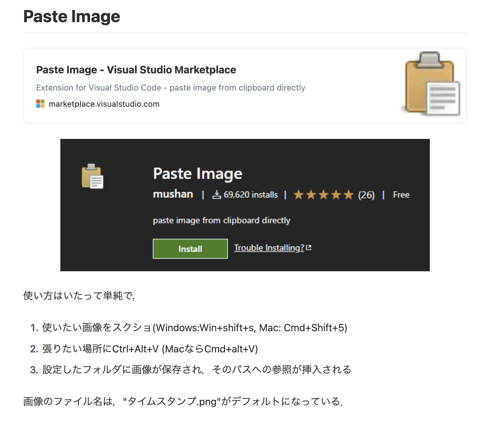

↑Yamlヘッダ
（title, author, dateの3項目が基本とのこと．
[ここから](http://cup.sakura.ne.jp/rpt2/rmd/introduction02.htm)）

おまけ↓（Paste Image という，markdownの画像パス自動参照を行うVSCode Extention）


# Ruby及びRailsの環境構築
Railsで簡単なWebAPIを作成するので，まずはRuby環境を構築します．

## 前提条件
自分の構成は次の通りです．

- OS: MacOS Monterey verion 12.6.5
- パッケージ管理: Homebrew 4.0.24
- エディタ: VSCode

## まずはリポジトリの作成
形から入るのが良いと天から掲示が．  
今回はGitHub上でリポジトリを作成しておきました．


現時点のディレクトリ構成は次の通りです．

```
$ tree -a -A -C -U -I .git
```
```
.
├── docs
│   ├── image
│   └── 001_setup.md  ←このファイル
├── README.md
└── .gitignore
```

## RubyやRailsの環境構築
と言ってもMacOSなので基本はインストール作業のみ．

### Homebrewのインストール
自分は既にインストールされているのでカットします．  
必要に応じて分かりやすいネット記事を参考にしてください．

### rbenvのインストール
rbenvは，Ruby本体のバージョン管理ツールだそう．  
nodebrewとかpyenvと同じ，いつものアレです．

rbenvの他に，rbenvのプラグインであるruby-buildも同時にインストールするのが一般的みたい．

```
$ brew install rbenv ruby-build
```

そして以下を`.zshrc`に記述します（bashの人は`.bashrc`へ）．  
この操作が無いとPATHが通らず，後のrubyのバージョン設定が上手くいきませんでした．  
なので，rubyコマンドが参照するPATHと，rbenvが参照するPATHを同期させます．

`~/.zshrc`を編集して，以下を追加します．
```
eval "$(rbenv init - zsh)"

$ sourve ~/.zshrc
```

インストールが完了したら，rbenvでインストール可能なRubyバージョンを確認します．

```
$ rbenv install --list

3.0.6
3.1.4
3.2.2
jruby-9.4.3.0
mruby-3.2.0
picoruby-3.0.0
truffleruby-23.0.0
truffleruby+graalvm-23.0.0

Only latest stable releases for each Ruby implementation are shown.
Use 'rbenv install --list-all / -L' to show all local versions.
```

バージョンの違いを把握していなかったので，とりあえず最新版のver3.2.2を選択しました．  
v2とv3で大きな違いがある可能性もあるので，後ほど調べておきます．

```
$ rbenv install 3.2.2
```

```
# インストール済みバージョンと現在のバージョンを確認
$ rbenv versions
* system (set by /Users/ss/.rbenv/version)
  3.2.2
```

続いて，使用するrubyのバージョンを指定します．

作業ルートディレクトリに移動して，以下を実行します．

```
# local設定でバージョン指定
$ pwd
/path/to/fibonacci-webapi

$ rbenv local 3.2.2

$ rbenv versions
  system
* 3.2.2 (set by /path/to/fibonacci-webapi/.ruby-versions)

$ ruby -v
ruby 3.2.2 (2023-03-30 revision e51014f9c0) [x86_64-darwin21]
```

ちなみに，`$ rbenv global [version]` でグローバルにバージョンを指定することもできます．  
作成済みのrubyプロジェクトは現在このプロジェクトだけですが，今回はlocalで指定しておきました．

最後に，rubyプロジェクトで使用する`gem`を管理する`bundler`をインストールします．  
（`node_modules`のバージョンや依存関係を管理する`npm`と同様のもの？）

どうやら既にインストールされているようでした．

```
$ bundler -v
Bundler version 2.4.10
```

## Railsのインストール
`rbenv`関連のインストールで少々疲れてしまいましたが，いよいよ本命の`Rails`をインストールします．  

```
# ローカルにインストール済みのrailsはありません
$ gem list -e rails

*** LOCAL GEMS ***

```

```
# rails公式サイトでバージョンを確認→2023/06/27時点で使用可能だった7.0.5をインストールします
$ gem install rails -v 7.0.5
```

```
# 正しくインストールされていますね
$ gem list -e rails

*** LOCAL GEMS ***

rails (7.0.5)
```