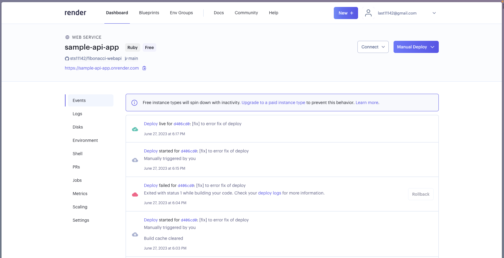
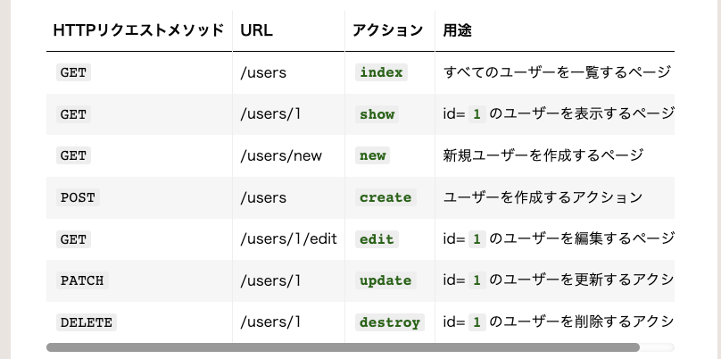
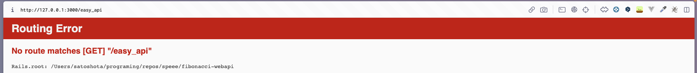

# さっそくデプロイして動作確認してみよう！
## railsの動作確認
さて，現時点で

- ruby 環境構築
- rails プロジェクトの作成

まで完了しました！

初めてのrailsプロジェクトなので，ワクワクが止まりません！！  
部屋も暑くなってきて，MacBookのファンの音も止まりません！！

...

熱気がもの凄いので，とりあえず窓を開けてきます．

---

窓も開いて涼しくなる準備が整ったところで，さっそくrailsアプリを起動してみます．

```
$ rails server
```
どうかな...？


*人生初のrailsアプリ起動画面*

やりました！無事に起動することができました．  
これが人生初のrailsです．．．感動で涙が出てきそうです．  
汗も止まりません（窓開けたのになあ）

起動できたら，少しいじってみたくなるのがヒトのサガ...

```diff ruby:app/controllers/application_controller.rb
class ApplicationController < ActionController::API
+  def hello
+    render html: "hello world!"
+  end
end
```

```diff ruby:config/routes.rb
Rails.application.routes.draw do
+  root 'application#hello'
end
```


*画面が変わりました！*

アプリが正しく動作することが確認できたので，この時点でデプロイしてみます．

デプロイエラー，アプリ制作冒頭で見るか，リリース直前で見るか...  
最後の最後で困ってしまうのも嫌なので，悩むなら今のうちに，のスタンスでいきましょう．


## Render.comにデプロイ
アプリをデプロイします．

使用するのは["Render.com"](https://dashboard.render.com/)．次世代のherokuと噂されているとの噂です（？？）

流れはこちらの記事を参考にさせていただきました．  
[【誰でも簡単】RailsアプリをRender.comでデプロイする手順まとめ - Qiita](https://qiita.com/koki_73/items/60b327a586129d157f38#web%E3%82%B5%E3%83%BC%E3%83%93%E3%82%B9%E4%BD%9C%E6%88%90)

[第1章 ゼロからデプロイまで - Railsチュートリアル](https://railstutorial.jp/chapters/beginning?version=7.0#cha-beginning)

ここで注意です．`bundle lock`なる設定を行っていなかったため，デプロイでコケました．  
エラーログを見ると，macユーザーはplatformが`x86_64-darwin-21`のようになるのかな？

ログに従って，次のようにして再度デプロイをします．

```
$ bundle lock --add-platform x86_64-linux

$ #きちんとgit remoteにpush
```

## 結論: デプロイを試みたら，エラーにめちゃんこ悩まされた
**リアルに2時間くらい．**  
調べて調べて解決に至らなかったので，ねね聞いてよ〜とChatGPTに聞いてみました．  
一瞬で的確な解答が返ってきて，AI賢い〜〜と泣きました．

### どういうエラーに遭遇したか？
Render.com で新規 web service を作り，初デプロイをしようとした時のこと．

Manual deploy -> **buildが通らない**．

具体的には，次のようなエラーログが出ました．

```
Jun 27 06:04:02 PM  rake aborted!
Jun 27 06:04:02 PM  Don't know how to build task 'assets:precompile' (See the list of available tasks with `rake --tasks`)
Jun 27 06:04:02 PM  /opt/render/project/.gems/ruby/3.2.0/gems/rake-13.0.6/exe/rake:27:in `<top (required)>'
Jun 27 06:04:02 PM  /opt/render/project/.gems/bin/bundle:108:in `load'
Jun 27 06:04:02 PM  /opt/render/project/.gems/bin/bundle:108:in `<main>'
Jun 27 06:04:02 PM  (See full trace by running task with --trace)
Jun 27 06:04:02 PM  rake aborted!
Jun 27 06:04:02 PM  Don't know how to build task 'assets:clean' (See the list of available tasks with `rake --tasks`)
Jun 27 06:04:02 PM  /opt/render/project/.gems/ruby/3.2.0/gems/rake-13.0.6/exe/rake:27:in `<top (required)>'
Jun 27 06:04:02 PM  /opt/render/project/.gems/bin/bundle:108:in `load'
Jun 27 06:04:02 PM  /opt/render/project/.gems/bin/bundle:108:in `<main>'
Jun 27 06:04:02 PM  (See full trace by running task with --trace)
Jun 27 06:04:02 PM  ==> Build failed 😞
```

- `rake aborted!`
- `Don't know how to build task 'assets:precompile' (See the list of available tasks with 'rake --tasks')`

といったメッセージをひたすらググって試してみましたが，解消せず...

rake（rails make）って何者？どこで動いてるの？`assets:precompile`ってどのファイルのどこに書かれてるの？...と，見事に見当違いな方向に進んでいきました．

### 何が問題だったか？
結論から言うと，**`--api`モードでrailsアプリを作成したため，Renderのデフォルトbuildコマンドとケンカしてエラーが起きていました**．

つまり，解決の糸口はプロジェクトの方にではなく，Render側のデフォルト設定にありました．

### 解決方法
デフォルトのbuildコマンドを変更してください．

Render.comのダッシュボードから，作成したweb serviceを選択します．


*今回のweb serviceに遷移した先のページ*

ページ左のサイドメニューから`Settings`に移動し，`Build & Deploy`のカテゴリで`Build Command`を見つけてください．


*Settings > Build & Deploy > Build Command*

デフォルトで次のようになっているので，これを書き換えます．

```
$ bundle install; bundle exec rake assets:precompile; bundle exec rake assets:clean;
```
↓
```
$ bundle install
```

再度`Manual Deploy`を実行することで，デプロイが成功するはずです． 
自分はこれで無事解決しました！！！


### エラーの背景
それでは，今回のエラーの背景について詳しく説明します．

### 1．`--api`とは？
今回のrailsアプリは簡単な(req, res)のweb apiを想定しているため，`rails new`する際に`--api`を指定していました．  
`--api`を指定すると，railsがViewを自動生成しなくなるそうです．  そのため，Viewは別で切り離して別で実装する時に便利そうだという印象がありました．

今回も，最後余裕があればフロント部分はVueかReactで作成したい気持ちだったので，`--api`を指定してプロジェクトを作っていましたが，これが根本の原因だったみたいです．

### デフォルトコマンドの`assets:`って何者？
さて，Railsには[アセットパイプライン](https://railsguides.jp/asset_pipeline.html)という仕組みがあるそうです．  
詳しく説明できるほど理解できていませんが，Viewに付随するCSSやJavaScriptなどのアセットをプリコンパイルするためのもので，要はRailsの中でCSSやJSを扱うための仕組みのようです．

今回はそもそもViewが無いため，先ほどのデフォルトコマンド`$ bundle install; bundle exec rake assets:precompile; bundle exec rake assets:clean;`の`assets:`に関するコマンドは実行する必要がなかったのですね．

無いものを実行しようとしていたため，エラーとして忠告されていたようです．

なるほど！  
だんだんとRailsの中身が分かってきたぞ


# 一応APIとしての体裁も整えておこう
タイトルにも"初期デプロイと**簡単なAPI作成**"と書いてしまっているので...

## ここでのゴール
デプロイ済みのアプリに関して，
- サーバ側が，あるWebAPIへのHTTPリクエスト（GETにしよう）を受信できる
- クライアント側が，受信したリクエストに対して次のレスポンスを受け取れる
  - 200ステータス
  - 何かテキスト

## ゴールを整理する
決めたゴールに対して，詳細に内容を決めていきます．

あと，一応featureブランチを切っておきます．

### （サーバ側）リクエストを受け取るページ
ここでは，新しく`/easy_api`ルートを作成して，このルートにおいてリクエストを受信できるようにします．

URL: [https://sample-api-app.onrender.com/easy_api](https://path/to/app/easy_api)

### （サーバ側）受信するHTTPリクエスト
今回は`GET`メソッドに限定したいと思います．

なぜなら，これは簡単なWebAPIの実装練習だから...

受け取った`GET`に対して，ステータスコード`200`番と，ここに来てくれてありがとうの意味を込めて感謝の言葉を返すことにしましょう．

### （クライアント側）期待するレスポンス
さて，クライアント側では`https://to/app/easy_api`に`GET`リクエストを送信します．

挨拶には挨拶で返しましょう，と習ってきた我々なので，当然何かしらの返事があると思っています．

例えば，リクエスト成功したよ！`"status: 200"`とか，訪れてくれてありがとう！`"message: Thanks!"`とかですね．


## リクエストを受け取るルートの作成
よく`/api/v[num]/`の階層構造を見かけますが，これはRESTfullなWebAPIを作成する際の一種のデファクトスタンダード？なのでしょうか．

今回はAPI単体を実装したいので，明示的にAPI用のルートを準備する必要はなさそうです．  
ということで，`/easy_api`のルートを作成すれば良さそうですね！

ルートを作成するため，railsチュートリアルに倣って，まずはControllerを作成していきます．

```
$ rails generate controller EasyApi
      create  app/controllers/easy_api_controller.rb
      invoke  test_unit
      create    test/controllers/easy_api_controller_test.rb
```

この操作により，`app/controllers/easy_api_controller.rb`が作成されました．

```diff ruby:app/controllers/easy_api_controller.rb
+class EasyApiController < ApplicationController
+end
```

このルートに`GET`を送る，ということは，すなわち`/easy_api`にアクセスするということです．  
なので，このページが参照された場合，そのまま目的のレスポンスを返してあげることにしましょう．

```diff ruby:app/controllers/easy_api_controller.rb
class EasyApiController < ApplicationController
+ def index
+  render json: { status: 200, message: "Thanks!" }
+ end
end
```


*[第2章 Toyアプリケーション - Railsチュートリアル](https://railstutorial.jp/chapters/toy_app?version=7.0#cha-a_toy_app)，表2.2より*

さて，ローカルで起動してみて検証してみます．

```
$ rails s
```

ん？あれれ，`/easy_api`を指定したらコケました．↓


*Routing Error*

`Routing Error`です．  
思い出したのですが，railsチュートリアルでもcontrollerを作成した際にルーティングファイルも変更していました．  
（確かにVueでもViewページ作成とルート設定はセットですね...）

ということで，以下の変更を加えて，改めてページを訪れます．

```diff ruby: config/routes.rb
Rails.application.routes.draw do
+ get 'easy_api', to: 'easy_api#index'
  root 'application#hello'
end
```

---

余談ですが，`get ~`と`resources ~`の違いがよく分かっていませんでした．  
調べてみた感じ，恐らく`resources ~`は複数のHTTPリクエストverbsに対応したものだと理解しました．

つまり，`resources`は`get ~`や`post ~`などを一括で定義できる文法なのかなと．

---

## ルートへ訪れてみる
さて，変更を加えてアクセスしてみると，無事にレスポンスが帰ってきたことが分かります．

ちゃんと感謝されてるので，OKです！


*`/easy_api`へのアクセス．期待どおりのレスポンス*


## Commit→Push→Merge→Deploy
変更をmainブランチに反映させて，デプロイします！

...(作業中)

デプロイ作業が完了しました．

実際に`/easy_api`ページ（[https://sample-api-app.onrender.com/easy_api](https://sample-api-app.onrender.com/easy_api)）を訪れてみると，レスポンスが正しく表示されています！

また，cURLコマンドでアクセスしても正しいレスポンスが返ってきました！！  
これは嬉しい！！！

```
$ curl https://sample-api-app.onrender.com/easy_api
{"status":200,"message":"Thanks!"}
```


# まとめ
今回は，サンプルアプリのデプロイと簡単なWebAPIを作成してみました．

簡単とはいえ，APIを自作したのは人生初めてだったので，デプロイまで完了した時は驚きと感動で胸がいっぱいでした．  
エラーとも向き合うことで，Railsの作りが少しだけ分かったような気もしました．

今回の発見は，以下の通りです．

- `--api`で作ったときは，Viewに関係するオプション等が不要
- `routes.rb`のルーティング記述はまだ難解．例えばHTTPリクエストに応じた指示語と，それらをまとめて指定する指示語がある
  - `get`や`post`など
  - `resources`