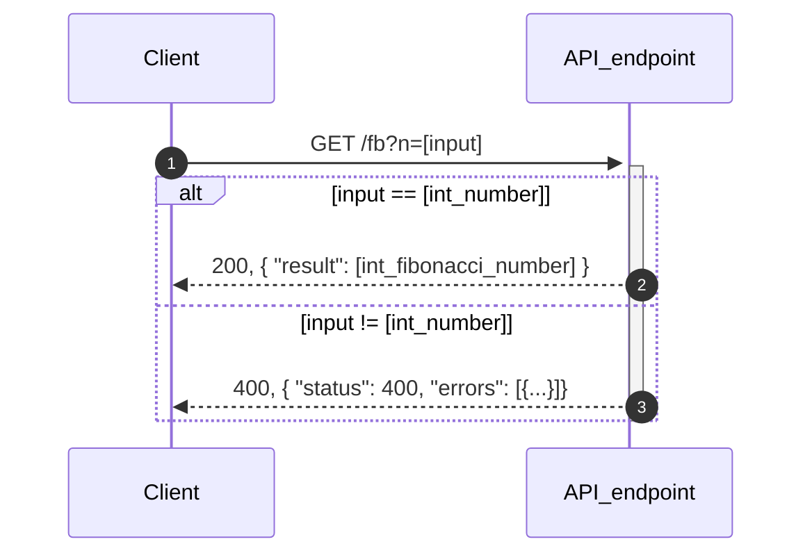

# このアプリについて

## 1．課題の仕様（要件）
* APIユーザーは，エンドポイントに対して`GET`リクエストを送信できる
  * その際，数値パラメータを付与する  ex)`?n=99`
* APIユーザーは，送信したリクエストへのレスポンスを受信できる
  * レスポンスはjsonデータである
  * リクエストが正しく受付されていた場合，レスポンスはパラメータに指定した数値のフィボナッチ数となる
  * リクエストが何らかの要因で正しく受付られなかった場合，レスポンスはエラーが格納されたjsonとなる
* リクエストヘッダには`Content-Type: application/json`を指定する
  * 本APIではレスポンス形式はjsonオンリーだが，一応念の為クライアント側でも指定する方が良さそう（？）
* 適切に実装されたユニットテストコードによって，APIが正しく実行されているかを検証することができる
  * API実装者が実装する
  * 正例，負例各々について検証する
  * ブラックボックステストを採用する
    * 他との依存がほとんど無い，簡単なAPIのため．ユニットテストがそのままインテグレーションテストとなる．

---

## 2．API仕様
| Path | Method | Desc |
| ---- | ------ | ---- |
|`/fib` | GET   | パラメータに指定した数値の<br />フィボナッチ数を取得する． |
| `/easy_api` | GET |  サンプルapi．<br />用意されたjsonデータを取得する． |
|  |  |  |

### `/fib`
```
  Method:
      only GET

  Request:
      Parameter: required
          ?n=[int_num]

  Response:
      status:
          200  :ok
              正常に受付
          400  :bad_request
              パラメータに格納された値が不正
                  数値(int)以外の値，値無し
      body:
          // 200
          {
            "result": [int_fibonacci_number]
          }
          // 400
          {
            "status": 400,
            "errors": [
              { "type": "bad-request", "title": "パラメータの指定が不正です" },
            ]
          }
      
  Desc:
      エンドポイントに対し，パラメータ指定した数値のフィボナッチ数を取得できるAPI．
          ex) https://sample-api-app/fib?n=10  ->  50
```

---

## 3．動作の流れ
mermaid記法を利用して，シーケンス図で表してみました．

> **vscode環境下でmarkdown previewを行う際の注意点．**  
mermaid記法で記述したコードを図として表示するには，以下のような拡張機能をインストールする必要があります．  

> [Markdown Preview Mermaid Support](https://marketplace.visualstudio.com/items?itemName=bpruitt-goddard.mermaid-markdown-syntax-highlighting)




