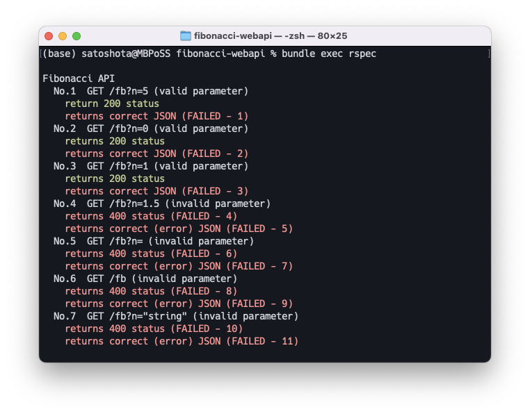

# ユニットテストを実装したい

## けど，rails でどうやって実装するんだろう！

rails も api テストも初心者なので，どこから手をつけて良いか不明です．

テスト駆動型開発（TDD）という考え方もあるようですが，細かな知識もないので今回は素直に [Rails チュートリアル](https://railstutorial.jp/chapters/static_pages?version=7.0#sec-our_first_test)で紹介されているテスト方法のお作法を参考にしてみます．

加えて，railsアプリのテストにはRSpecというテスティングフレームワークを使うのが一般的のようです．  
今回テストの規模は小さいですが，今後の練習も兼ねてRSpecを利用してみます．

### 事前にテストを作成することのメリット・デメリット
メリット

- テスト漏れが重大なインシデントとなるロジックや，他のロジックと関連しているものに対して有効
- 全テストケース合格 ≒ 実装完了

デメリット

- 仕様（in/out）が変わった場合，テストが無駄になる

今回は要求仕様が決まっていて変化しないので，事前にテストを作成する方針でいきます．

### RSpecについて
Rspecは，Rubyにおけるテスティングフレームワークです．  
ドキュメント記述のようにテストケースを作成することができるとのこと．ワクドキ

---

## ユニットテストの流れ

基本的に，「開発＝テストケース全合格」の流れで開発を行います．  
テストケースを充足していれば，すなわち実装完了とします．（このやり方が正しいのかは分からない...）

1. path `/fb`を作成する
    - controller, routes
1. `/fb`に対するテストを作成する
1. そのテストを実行し，エラーを確認する
1. そのテストを満たすようにコーディングを行う
1. テストがオールグリーンになるまで{コーディング→テスト}を繰り返す

---

# テストケースを作成する！！
実装の前にテストケースを作成します．このテストをクリアしたら実装完了，と言うためには，網羅的にテストケースを用意する必要があるか...が今回はテスト対象が1ルートだけなので，恐らく簡単（？）

## テストケース

テストケースを考えます．  
といっても今回は，パラメータの値が正しい場合と正しくない場合の2種類のみですが！

| No. | パラメータ`n`の値 | status・json |
| :-: | -| - |
|  1  | ?n=10 | 200・{ "result": 55 } |
|  2  | ?n=0 | 200・{ "result": 0 } |
|  3  | ?n=1 | 200・{ "result": 1 } |
|  4  | ?n=1.5 | 400・{ "status": 400, "errors": <br />[{"type": "invalid-parameter", "title": "パラメータの値が不正です"}] } |
|  5  | ?n=(指定なし) | 400・{ "status": 400, "errors": <br />[{"type": "invalid-parameter", "title": "パラメータの値が不正です"}] } |
|  6  | /fb (?n= が無し) | 400・{ "status": 400, "errors": <br />[{"type": "invalid-parameter", "title": "パラメータの値が不正です"}] } |
|  7  | ?n="string" | 400・{ "status": 400, "errors": <br />[{"type": "invalid-parameter", "title": "パラメータの値が不正です"}] } |
| | | |


フィボナッチ数はn=0,1の時の値が定義されているため，検証を行います（境界値分析っぽく）．  
また，最大数は考慮しません（rubyは整数型の最大幅が無限...固定長の長さを超えるとメモリ依存の無限多倍長整数に拡張されるとのこと．wow）

"errors"を配列にしているので，エラーの種類に応じて複数のエラーを渡せます．  今回は時間があったら作り込みましょう（この文章が残っているということは，つまりそういうこと）


# APIを実装する！！ with テスト

ユニットテストの流れを参考にして，早速コーディングします！

## Rspecのインストール
最初にRspecをプロジェクトにインストールしておきます．

Rspecの準備に関して詳しい手順や説明を知りたい方は，以下の記事がおすすめです！

[【Rails】Rspecの環境構築手順をざっくりまとめてみた](https://zenn.dev/yukihaga/articles/816758ff6f0bdf)

### gemの追加
`rspec-rails`をGemfileに加えます．

```Gemfile: /Gemfile
group :development, :test do
  gem "debug", platforms: %i[ mri mingw x64_mingw ]
  gem 'rspec-rails'  # バージョン未指定で警告が出なかったので，一旦このままにする
end
```

```
$ budle install
```

Rspecの基本設定ファイルを生成します．

```
$ rails g rspec:install
      create  .rspec
      create  spec
      create  spec/spec_helper.rb
      create  spec/rails_helper.rb
```

テストの実行結果表示を読みやすくするための設定を記述します．
```.rspec: /.rspec
...
--format documentation
```

`spec/support`配下のファイルを読み込むために，以下の一文をコメントアウト解除します．
```ruby: spec/support
Dir[Rails.root.join('spec', 'support', '**', '*.rb')].sort.each { |f| require f }
```


## Controllerの生成
`fb`controllerを`generate`して，apiのエンドポイント`/fb`を作成します．同時にルーティングも対応させます．

```
$ rails generate controller fb
      create  app/controllers/fb_controller.rb
      invoke  test_unit
      create    test/controllers/fb_controller_test.rb
```

```diff ruby: config/routes.rb
Rails.application.routes.draw do
  get 'easy_api', to: 'easy_api#index'
+ get 'fb', to: 'fb#index'

  root 'application#hello'
end
```

続いて，`fb` controllerにaction `index` を追加します．  
`index`はGETメソッドに対応します．

この後テストコードを書くので，中身は適当な記述をしておきます．


```ruby:app/controllers/easy_api_controller.rb
class FbController < ApplicationController
  def index
    render json: { message: "init" }
  end
end
```

さて，ここまででパスを用意することができました．ローカルで起動して確認します．


*成功　path: `/fb`*

## テストの記述
パスの準備が終わったので，次にテストを作成します．

### rspecファイルの準備

rspecのコマンドで`fb`をテストするためのファイルを作成します．

```
$ rails g rspec:request fb
      create  spec/requests/fbs_spec.rb
```

> **controller spec  →  request spec**  
Rails5から，Controllerのテストはrequest specで書くことが推奨されているようです．  
request specでは，URLのリクエストがちゃんと通るかを主にテストしていきます．

> これから新しく作成する Rails アプリケーションについては、 rails-controller-testing gem を追加するのはおすすめしません。 Rails チームや RSpec コアチームとしては、代わりに request spec を書くことを推奨します。 Request spec は一つのコントローラーアクションにフォーカスしますが、 controller spec とは違い、ルーターやミドルウェアスタック、Rack リクエストやレスポンスも関与します。 これによって、より現実に近い環境でテストを実行し、controller spec で発生しがちな多くの問題を避けることができます。 Rails 5 では、request spec が Rails 4までの request spec や controller spec よりもかなり高速になっています。 これは Rails チームの Eileen Uchitelle[^foot_1] のおかげです。  
[RSpec 3.5 がリリースされました！](https://rspec.info/ja/blog/2016/07/rspec-3-5-has-been-released/)  

> [【Rspec入門#8】Controllerのテストの書き方（request specの書き方） | みやちゃのブログ](https://ymiyashitablog.com/rails-rspec-8/)


### request specを記述する
先ほどのコマンドライン実行によって，`spec/requests/fbs_spec.rb`のパスにテストスクリプトを記述するためのファイルが生成されました．

最初に設定したテストケースを記述していきましょう．

```ruby: spec/requests/fbs_spec.rbj
require 'rails_helper'

RSpec.describe "Fibonacci API", type: :request do
  # テストケース，response bodyは仕様を確認すること

  # No.1  正例  パラメータが適切な値
  describe 'No.1  GET /fb?n=5 (valid parameter)' do
    # エンドポイント，パラメータ，リクエスト形式
    before do
      get '/fb', params: { n: 10 }
    end

    # 200: リクエストが正常に処理された
    it 'return 200 status' do
      expect(response).to have_http_status(200)
    end

    # fibonacci(10)=55
    it 'returns correct JSON' do
      json = JSON.parse(response.body)  # response.body は文字列
      expect(json['result']).to eq(55)
    end
  end


  # No.2  正例  パラメータn=0
  describe 'No.2  GET /fb?n=0 (valid parameter)' do
    before do
      get '/fb', params: { n: 0 }
    end

    # 200: リクエストが正常に処理された
    it 'returns 200 status' do
      expect(response).to have_http_status(200)
    end

    # fibonacci(0)=0
    it 'returns correct JSON' do
      json = JSON.parse(response.body)  # resuponse.body は文字列
      expect(json['result']).to eq(0)
    end
  end


  # No.3  正例  パラメータn=1
  describe 'No.3  GET /fb?n=1 (valid parameter)' do
    before do
      get '/fb', params: { n: 1 }
    end

    # 200: リクエストが正常に処理された
    it 'returns 200 status' do
      expect(response).to have_http_status(200)
    end

    # fibonacci(0)=0
    it 'returns correct JSON' do
      json = JSON.parse(response.body)  # resuponse.body は文字列
      expect(json['result']).to eq(1)
    end
  end


  # No.4  負例  パラメータが不動小数点数
  describe 'No.4  GET /fb?n=1.5 (invalid parameter)' do
    before do
      get '/fb', params: { n: 1.5 }
    end

    # 400: リクエストに異常があり，正しく受付されなかった
    it 'returns 400 status' do
      expect(response).to have_http_status(400)
    end

    # error-type: 'incalid-parameter'
    it 'returns correct (error) JSON' do
      json = JSON.parse(response.body)  # resuponse.body は文字列
      expect(json['status']).to eq(400)
      expect(json['errors']).to eq( [ 'type' => 'invalid-parameter', 'title' => 'パラメータの値が不正です' ] )
    end
  end
  

  # No.5  負例  パラメータに値を指定しない
  describe 'No.5  GET /fb?n= (invalid parameter)' do
    before do
      get '/fb?n='
    end

    # 400: リクエストに異常があり，正しく受付されなかった
    it 'returns 400 status' do
      expect(response).to have_http_status(400)
    end

    # error-type: 'incalid-parameter'
    it 'returns correct (error) JSON' do
      json = JSON.parse(response.body)  # resuponse.body は文字列
      expect(json['status']).to eq(400)
      expect(json['errors']).to eq( [ 'type' => 'invalid-parameter', 'title' => 'パラメータの値が不正です' ] )
    end
  end


    # No.6  負例  パラメータを指定しない
    describe 'No.6  GET /fb (invalid parameter)' do
      before do
        get '/fb'
      end
  
      # 400: リクエストに異常があり，正しく受付されなかった
      it 'returns 400 status' do
        expect(response).to have_http_status(400)
      end
  
      # error-type: 'incalid-parameter'
      it 'returns correct (error) JSON' do
        json = JSON.parse(response.body)  # resuponse.body は文字列
        expect(json['status']).to eq(400)
        expect(json['errors']).to eq( [ 'type' => 'invalid-parameter', 'title' => 'パラメータの値が不正です' ] )
      end
    end


  # No.7  負例  パラメータの値が文字列
  describe 'No.7  GET /fb?n="string" (invalid parameter)' do
    before do
      get '/fb', params: { n: "string" }
    end

    # 400: リクエストに異常があり，正しく受付されなかった
    it 'returns 400 status' do
      expect(response).to have_http_status(400)
    end

    # error-type: 'incalid-parameter'
    it 'returns correct (error) JSON' do
      json = JSON.parse(response.body)  # resuponse.body は文字列
      expect(json['status']).to eq(400)
      expect(json['errors']).to eq( [ 'type' => 'invalid-parameter', 'title' => 'パラメータの値が不正です' ] )
    end
  end

end
```

```ruby: app/controllers/fb_controller.rb
class FbController < ApplicationController
  def index
    render json: { message: "init" }
  end
end
```

テスト記述が誤っていないか，早速テストを実行してみます．

```
$ bundle exec rspec
```

テスト結果は以下のようになりました．

テストが正しく実行されていることが分かりました！！


*初テスト画面*

---

## 試しに1つテストケースをクリアさせてみる
テストが正しくクリアできるか検証してみます．

controllerを以下のように変更して，1番目のテストをクリアするようにします．


```ruby: app/controllers/fb_controller.rb
class FbController < ApplicationController
  def index
    render status: 200, json: { "result": 55 }
  end
end
```

```
$ bundle exec rspec
```


*テストをクリアさせてみる*

1つ目のテストをクリアしました！

ここでは記述しませんが，各テストが通ることを確認しました．  
（事前にテストを作成する場合，記述したテストケースが正しいことを検証する必要はある...？）

---

## controllerを実装する
テストの作成が完了したので，controllerwを作り込んでいきます．

作成の順番は次のようにします．

1. fibonacci数を返す`fibonacci`関数を実装する
1. controllerで，`fibonacci`メソッドを呼び出す
1. controllerで，受け取ったパラメータのvalidationを行う（適宜エラー処理）


### fibonacci数を返す`fibonacci`関数を実装する
fibonacci数を返す関数は，fibonacci数列と再帰ロジックで実装できます．

railsでロジックを記述する際，次のような方法が考えられるとのこと．

> [Railsでロジックをどこに書くか](https://zenn.dev/maeharin/scraps/173bafb5096faf)  
ロジックを書く場所の候補は以下
> - Controller（GraphQLならmutation, query）
> - Modelのメソッド
> - Modelのコールバック
> - concern
> - PORO（Service、UseCase層）<br />

> [【Rails】Serviceオブジェクトとの付き合い方。 - Qiita](https://qiita.com/ren0826jam/items/6d3fa4c5dbdf1625e441)  
> Serviceオブジェクトとは  
肥大化したActiveRecordモデルを分割し、コントローラをスリムかつ読みやすくするうえで非常に有用な、Ruby on Rails開発における一種の開発パターンです。  
> どんな時に利用する？  
> - 複数のモデルに対するコールバックなどを含み、多くの手順で構成された複雑なアクションで、適切な定義箇所が見つからない場合
> - アクションから外部サービスとやりとりする場合

fibonacci数を返す関数は，見方を変えれば本apiから別のfibonacci_apiと通信を行う構造とも考えることもできます（本apiが外部apiのラッパーとなっているケース）．  
そのため，controllerに直接記述するのではなくロジックとして切り分けたいという発想に到りました．

Serviceオブジェクトはアンチパターン批判されることもあるようです...  

Serviceオブジェクトの構造や，rubyの`class`の文法の知識がないため，いろいろな記事を参考に実装してみました．

> [RailsでのService Objectの上手な使い方 | giftee engineer blog](https://blog.giftee.dev/2023-02-20-rails-service-object/)

> [RailsでのService Objectの上手な使い方 | giftee engineer blog](https://qiita.com/nk-ty/items/654b285a7bcbd82b1cff)

> [【Ruby】attr_accessor(attr_reader, attr_writer)について調べた - Qiita](https://qiita.com/aberyotaro/items/626a88388d44802240a0)


```ruby: app/services/fibonacci_calculator_service.rb
# app/services/fibonacci_calculator_service.rb

class FibonacciCalculatorService
  attr_reader :input_num  # fobinacci数列に入力する値

  # publicメソッドをクラスメソッドとするやり方
  # https://blog.giftee.dev/2023-02-20-rails-service-object/
  def self.call(...)
    new(...).call
  end

  def initialize(base_num)
    @input_num = input_num
  end

  def call
    fibonacci(@input_num)
  end

  # 引数nが正の値であることは，呼び出し元（controller側）で保証されているものとする
  def fibonacci(n)
    # fib[]: fibonacci数を次々と追加していくための配列
    fib = [0, 1]

    # fib配列に格納されたfibonacci数を用いて，次のfibonacci数を計算して追加する
    (2..n).each do |i|
      fib[i] = fib[i - 1] + fib[i - 2]
    end

    # fib配列の最後の要素が求めるfibonacci数である
    return fib[n]
  end
end
```

余談

railsはファイル名も定数として扱うという仕様らしく，クラス名とファイル名の一致であったり，ディレクトリ構造と名前空間を対応させる必要がある，ということを学びました．  
これに関連して，デフォルトにないディレクトリ（`app/services`）を作成した際，railsがファイル名を読み取ってくれない時がありました．  

.png)
*再現エラーです．この画面では，あえてクラス名をタイポしてエラー画面を再現しました*

今回の解決方法は単純で，rails serverを再起動したら直りました．  
下の記事によると，恐らく`spring`という機能に原因があったと思われます．再起動したことによってファイルが読み込まれてエラーが解消しました．

> [Rails Service追加したらNameError: uninitialized constant-エンジニアtonブログ](https://www.tontonton.work/2022/02/rails-servicenameerror-uninitialized.html)


### controllerで，受け取ったパラメータのvalidationを行う

実装したfibonacciメソッドを呼び出しつつ，冒頭でパラメータのvalidationを行います．

以下の場合はエラーとなります．

- パラメータが存在しない
- パラメータが整数ではない
  - 文字列
  - 浮動小数点数
  - bool値
  - その他
- パラメータの数値が正数ではない


```ruby: app/controllers/fb_controller.rb
# app/controllers/fb_controller.rb

class FbController < ApplicationController
  def index
    n_str = params[:n]

    invalid_error = { "type" => "invalid-parameter", "title" => "パラメータの値が不正です" }

    # パラメータが存在しないとき → error
    if !n_str.present?
      return render json: {
        "status": 400,
        "errors": [ invalid_error ]
      }, status: 400
    end

    # 整数ではない or 負数のとき → error
    if (is_integer?(n_str) == false) || (n_str.to_i < 0)
      return render json: {
        "status": 400,
        "errors": [ invalid_error ]
      }, status: 400
    end

    # nは非負整数であることが保証されている
    n = n_str.to_i
    @result = FibonacciCalculatorService.call(n)  # fibonacci数を取得する

    return render status: 200, json: { "result": @result }
  end


  private

  # 引数の文字列が整数値であることを確認する
  #     "2.0".to_i → 2.to_s → "2" != "2.0"
  #     "str".to_i → 0.to_s → "0" != "str"
  def is_integer?(str)
    return str.to_i.to_s == str
  end
end
```

様々な記事とChatGPTのおかげで，苦闘の末に実装が完了しました．  
validationの方法で悩みましたが，値の変換の前後でものが同じかどうか，というやり方が汎用的に使えるかなということで採用してみました．


## テストを実行してみる...！

controllerの実装が正しいものかどうか，Rspecで検証します．

```
$ bundle exec rspec
```


*無事，全パターンでテストが通りました！！*

（本当はテストをしながら実装していました...！現時点の実装が正しいかどうか確認しながら実装できたので，実装時のメンタルダメージが少なかったです！事前にテストを書いていたおかげだ〜〜〜）

---

# デプロイする！！！

ローカル環境でAPI実装が完了したので，実際にデプロイして試してみます．

